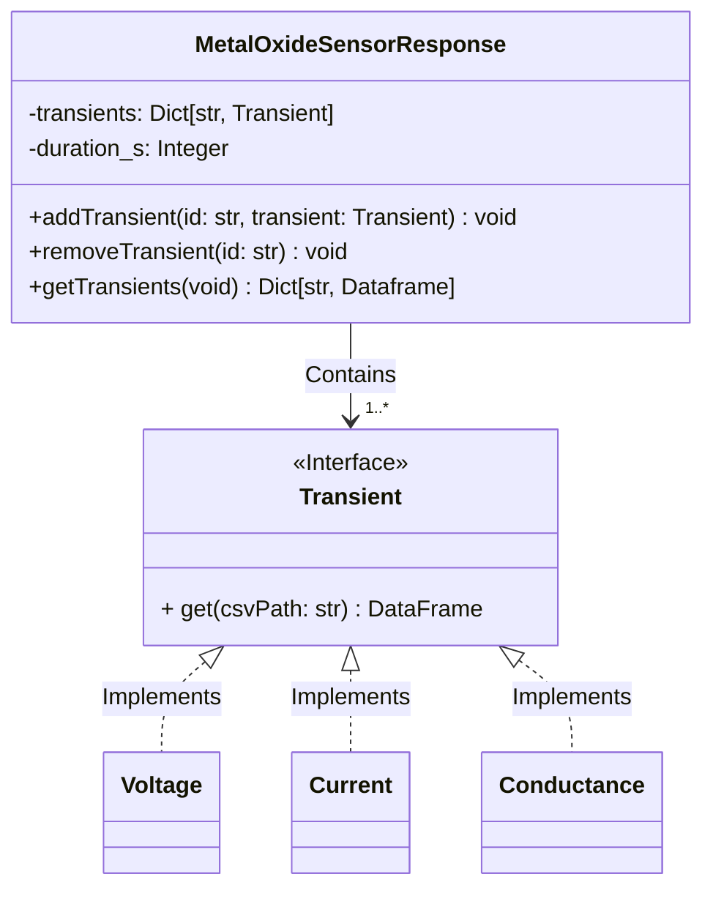
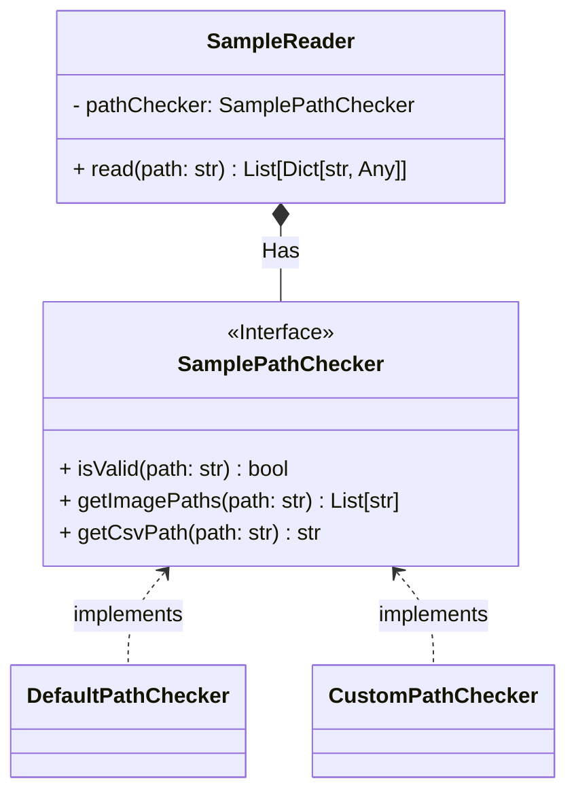

# E-nose Data Analysis
## Introduction
This repository contains analytics for the experimental ordor dataset I created using the hybrid-electronic nose designed as an aiding device for non-invasive diaganosis. I published an IEEE research article as a main author based on this device and the code used for the analytics of the dataset can be found in this repo. For the published article, please refer to [IEEEXplore](https:/ieeexplore.ieee.org/document/9495905).

## Architectural Diagram

### Sensor Responses

### Sample Reading

## Resources

### Mocking
- [Pytest Mock](https://github.com/pytest-dev/pytest-mock/)
- [Unittest Mock](https://docs.python.org/3/library/unittest.mock.html#patch-object)

### Pytest
- [Skipping Test Cases](https://docs.pytest.org/en/7.1.x/how-to/skipping.html)